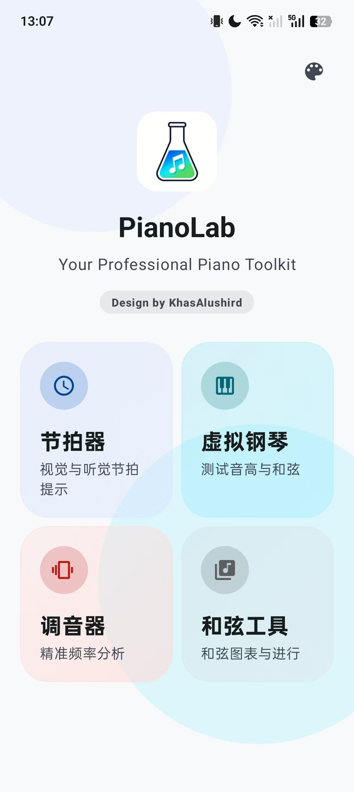
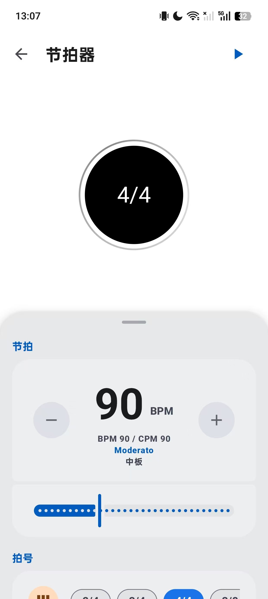
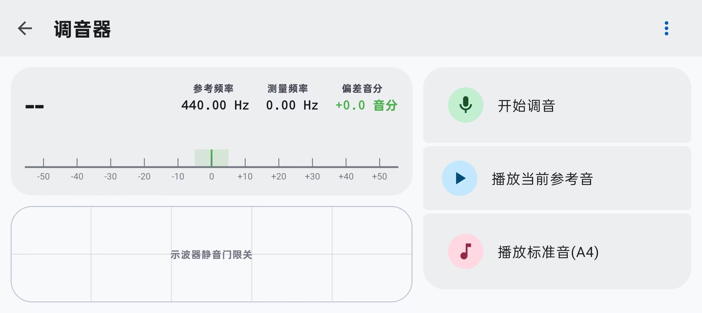
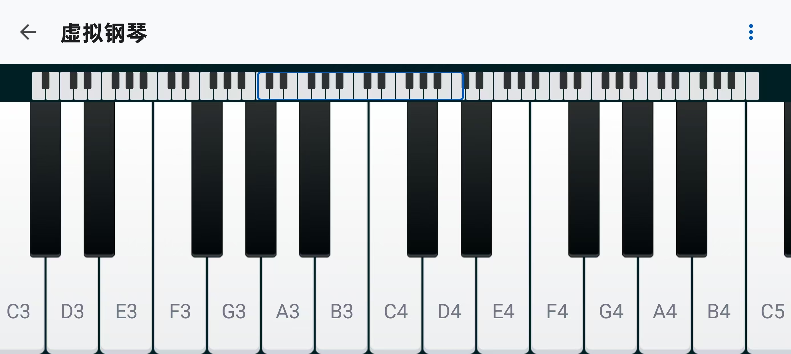
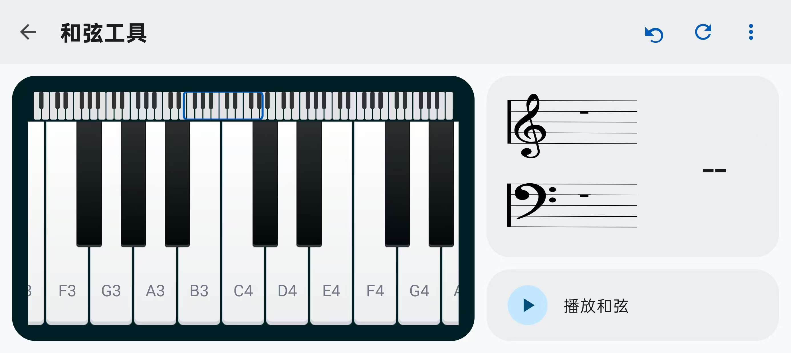

<div align="center">

# PianoLab

**钢琴练习小工具合集 · Material 3 界面**

[](https://android.com)
[](https://developer.android.com)
[](https://openjdk.org/)
[](https://m3.material.io/)

[📥 下载 Release](https://github.com/Abdulla-abs/PianoLab/releases) · [🐛 反馈 Issue](https://github.com/Abdulla-abs/PianoLab/issues) · [🔗 上游项目](https://github.com/KhasAlushird/PianoLab)

</div>

---

## 关于本仓库

本仓库 fork 自 [KhasAlushird/PianoLab](https://github.com/KhasAlushird/PianoLab)，在保留原有功能的基础上，对全部页面进行了 **Material Design 3** 风格 UI 重构，并补充了浅色 / 深色 / 跟随系统等外观选项。

> **说明：** 这是个人维护的 fork 版本，**不计划向上游提交 Pull Request**。若需原版代码或作者信息，请访问上游仓库。

## 简介

**PianoLab** 是一款面向钢琴爱好者与音乐初学者的 Android 应用，集成节拍器、调音器、虚拟钢琴与和弦工具，界面简洁，适合日常练习与乐理辅助。

项目使用 **Java** 开发，音频分析基于 [TarsosDSP](https://github.com/JorenSix/TarsosDSP)。

---

## 界面预览

<table>
  <tr>
    <td align="center" width="50%">
      
      <br/>
      <sub>🏠 主页</sub>
    </td>
  </tr>
</table>

<table>
  <tr>
    <td align="center" width="50%">
      
      <br/>
      <sub>🥁 节拍器</sub>
    </td>
    <td align="center" width="50%">
      
      <br/>
      <sub>🎵 调音器</sub>
    </td>
  </tr>
  <tr>
    <td align="center" width="50%">
      
      <br/>
      <sub>🎹 虚拟钢琴</sub>
    </td>
    <td align="center" width="50%">
      
      <br/>
      <sub>🎼 和弦工具</sub>
    </td>
  </tr>
</table>

---

## 功能特性

| 模块 | 主要能力 |
| :--- | :--- |
| **🥁 节拍器** | BPM / 每分钟四分音符双模式调速；多种拍号与特殊节奏型；多种音色切换；Material 3 设置面板 |
| **🎵 调音器** | 自动 / 手动检测音高；自动截止；实时波形与频域显示；音分偏差可视化 |
| **🎹 虚拟钢琴** | 88 键全滚动键盘；延音与音名显示；可交互音域概览 |
| **🎼 和弦工具** | 和弦检测与构造；常见和弦及转位；和弦播放；M3 滚轮选择器 |

| **🎨 外观** | **⚙️ 其他** |
| :--- | :--- |
| Material 3 组件与配色体系 | 沉浸式系统栏适配 |
| 浅色 / 深色 / 跟随系统 | MVVM + DataBinding 架构 |
| 各模块独立设置抽屉 / 底部面板 | minSdk 30 · targetSdk 36 |

> **系统要求：** Android 11+（API 30）· 调音器功能需麦克风权限

---

## 下载与安装

前往 [Releases](https://github.com/Abdulla-abs/PianoLab/releases) 页面下载最新 APK，安装后即可使用。

---

## 从源码构建

### 环境要求

| 项目 | 版本 |
| :--- | :--- |
| Android Studio | 推荐最新稳定版 |
| compileSdk | 36 |
| minSdk | 30 |
| JDK | 11 |

### 构建步骤

1. 克隆本仓库：

   ```bash
   git clone https://github.com/Abdulla-abs/PianoLab.git
   ```

2. 使用 Android Studio 打开项目根目录。
3. 等待 Gradle 同步完成。
4. 连接设备或启动模拟器，点击 Run 运行。

---

## 致谢

- 原始项目作者：[KhasAlushird/PianoLab](https://github.com/KhasAlushird/PianoLab)
- UI 设计参考：[Material Design 3](https://m3.material.io/)
- 音高检测库：[TarsosDSP](https://github.com/JorenSix/TarsosDSP)

---

<div align="center">

*个人练手项目，使用中如遇 Bug 或性能问题，欢迎通过 Issue 反馈。*

</div>
