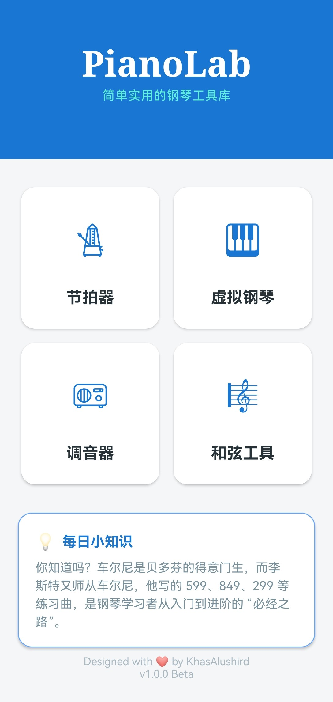

# PianoLab 



> 基于 Android 开发的钢琴常用小工具合集。

## 简介

**PianoLab** 是一款为钢琴爱好者和音乐初学者设计的 Android 应用程序。这是我作为本科生出于兴趣独立开发的项目，旨在通过简洁的界面提供实用的音乐辅助工具，帮助用户更好地练习和理解音乐。

本项目完全使用 **Java** 语言开发。

*此项目是我作为Android开发新手的练手项目，使用过程中可能会遇到bug或是性能问题，系本人能力有限，敬请谅解（有时间可能会修复和优化）。*


## 功能特性

PianoLab 集成了四个核心功能模块，满足日常练习的多种需求：

### 1. 节拍器 (Metronome)

*   *支持BPM或是每分钟四分音符的个数双模式调整速度*
*   *支持不同拍号*
*   *支持特殊节奏型的练习*
*   *支持切换各种音色*

### 2. 调音器 (Tuner)

*   *支持自动检测音高和手动检测音高双模式*
*   *提供自动截止检测的功能*
*   *实时显示频域图或时域图*
*   *可视化音分偏差*

### 3. 虚拟钢琴 (Virtual Piano)

*   *支持88键全滚动*
*   *提供延音和音名显示功能*

### 4. 和弦工具 (Chord Tool)

*   *提供检测和弦和构造和弦双功能*
*   *支持常见和弦及其转位*
*   *提供播放和弦的功能*

## 使用
   ### 下载release处的apk即可安装使用

## 运行

### 环境要求
*   Android SDK: *21 (推荐) 或更高版本*
*   Java Development Kit (JDK): API36

### 如何构建
1. 克隆本项目到本地：
   ```bash
   git clone https://github.com/KhasAlushird/PianoLab.git
   ```
2. 使用 Android Studio 打开项目根目录。
3. 等待 Gradle 同步完成。
4. 连接 Android 设备或启动模拟器，点击运行即可。


---
*感谢您使用 PianoLab！如果您有任何建议或发现了 Bug，欢迎提交 Issue。*
